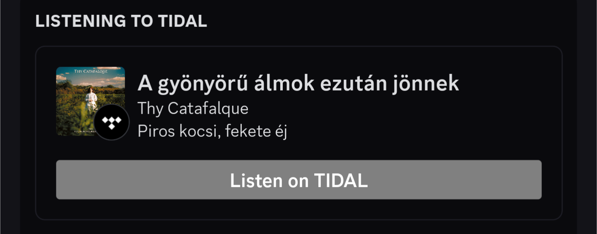

# Discord Rich Presence for TIDAL
This is a simple program that allows you to show what you're listening to on TIDAL on Discord, **with** support for animated covers.


<br />


This implementation uses .NET code via the [edge.js](https://www.npmjs.com/package/edge-js) library to scrape the main window title, which it then uses to call the TIDAL API and get basic info about your song, as well as the album cover. <br />

This app was designed with Windows in mind. If you want a similar experience on Linux, please check out the fantastic [Tidal Hi-Fi](https://github.com/Mastermindzh/tidal-hifi) project, which has excellent built-in Discord RPC support.

# WARNING! ⚠️
## <ins>This program uses the selfbot version of the discord.js library. This is against Discord's TOS and can get you banned. Use at your own risk.</ins>

# Installation

1. Clone the repository:
```git clone https://github.com/AleksandarN-BG/PublicDiscordTidalRPC.git```
2. Install the required packages:
```npm install```
3. Edit the `config.json` file and put your Discord token in the `token` field, channel ID - preferably an empty channel in your own private server _(make sure you have Developer Mode turned on and then right-click the channel)_ in the `channel_id` field and **two-letter** country code in the `country_code` field.

# Usage

1. Run the program:
```npm run-script run```

# License

This project is licensed under the MIT License - see the [LICENSE](LICENSE) file for details.
